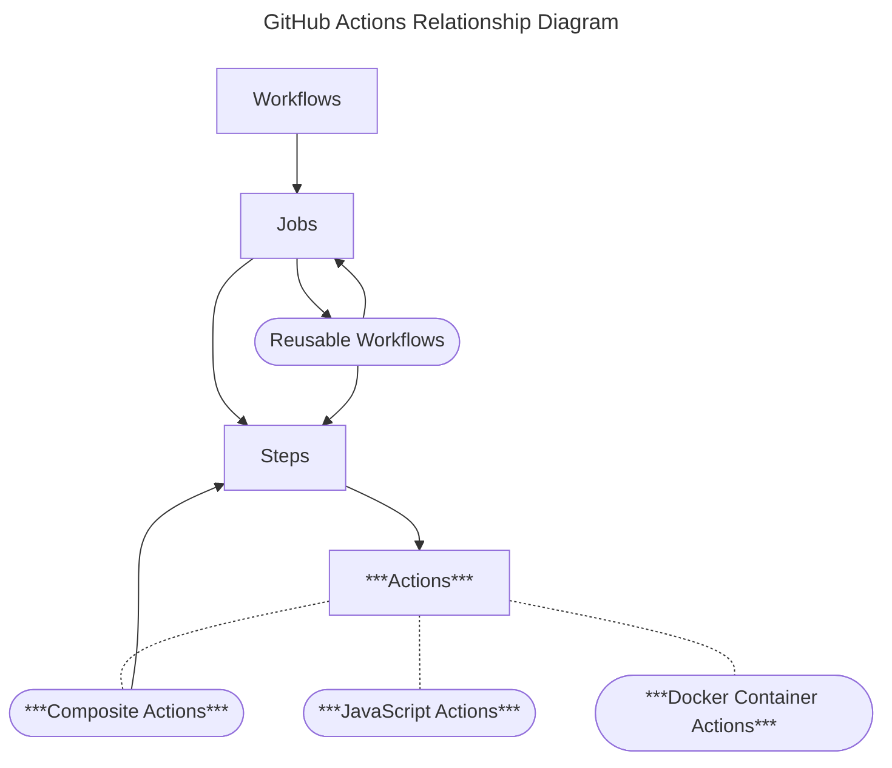

# DevantlerTech GitHub Actions

> [!NOTE]
> For reusable workflows, see [devantler-tech/reusable-workflows](https://github.com/devantler-tech/reusable-workflows).

Composite actions for CI/CD pipelines across DevantlerTech projects.

## Actions

| Action | Description |
|--------|-------------|
| [approve-pr](approve-pr/README.md) | Approve a PR using a GitHub App identity |
| [cleanup-ghcr-packages](cleanup-ghcr-packages/README.md) | Clean up old GHCR packages |
| [create-issues-from-todos](create-issues-from-todos/README.md) | Create GitHub issues from TODO comments |
| [enable-auto-merge-on-pr](enable-auto-merge-on-pr/README.md) | Enable auto-merge on a pull request |
| [login-to-ghcr](login-to-ghcr/README.md) | Login to GitHub Container Registry |
| [run-dotnet-tests](run-dotnet-tests/README.md) | Test .NET solution or project with coverage |
| [setup-copilot-skills](setup-copilot-skills/README.md) | Install agent skills via `gh skill` from a manifest or inline list |
| [setup-go-toolchain](setup-go-toolchain/README.md) | Setup Go with optional private module support |
| [setup-ksail-cli](setup-ksail-cli/README.md) | Install KSail CLI via Homebrew |
| [sync-github-labels](sync-github-labels/README.md) | Sync GitHub labels from a configuration file |
| [update-copilot-skills](update-copilot-skills/README.md) | Resolve and pin the latest skill refs back into `skills-lock.json` |
| [upsert-issue](upsert-issue/README.md) | Create, update, reopen, or close a GitHub issue by title |

## Contributing

See [CONTRIBUTING.md](CONTRIBUTING.md) for conventions and guidelines.
